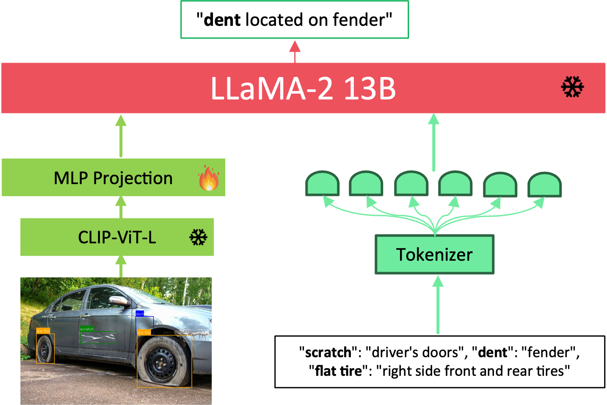

#  CarDVLM: Car Damage Assessment using Vision-Language Models  

Accurate vehicle damage assessment is critical for **automotive eCommerce platforms**, where buyers depend on transparent visual evidence to make informed purchasing decisions. Traditional object detectors (e.g., YOLO, Mask R-CNN) can localise damage but fail to provide contextual explanations such as **type, location, and severity**.  

To address this gap, we introduce **CarDVLM**, a multimodal framework that integrates **GroundingCarDD** with a fine-tuned **vision–language model (LLaVA)**. The system detects and localises damages, then generates **structured, query-driven textual descriptions**, enabling interpretable and user-centric assessments.  

---

## 📑 Paper  

<span class="link-block">
  <span class="external-link button is-normal is-rounded is-dark">
    <span class="icon">
      <i class="ai ai-arxiv"></i>
    </span>
    <span>Paper (Under Review)</span>
  </span>
</span>  

---

##  Key Contributions  

- **CarDVLM Framework**  
  A domain-adapted system combining **phrase-grounded object detection** with multimodal reasoning for interpretable car damage analysis.  

- **Structured Automotive Dataset**  
  Constructed from public (CarDD) and private sources, with bounding box annotations and semantically aligned descriptions across **25 vehicle body parts**.  

- **CarDamageEval**  
  A two-tier evaluation framework that measures structured accuracy with precision, recall, F1, and human-aligned evaluation.  

- **Ablation Study under Real-World Scenarios**  
  Comprehensive testing across three challenging conditions:  
  - Clearly visible damages  
  - Spatially ambiguous damages (left/right or front/rear orientation)  
  - Extremely subtle or partially obscured damages  
  This validates CarDVLM’s robustness and practical deployment readiness.  

---

##  Results  

### Structured Evaluation (Pair-Matching)  
| Model      | Accuracy | Precision | Recall | F1 Score |
|------------|----------|-----------|--------|----------|
| ChatGPT    | 59.5     | 59.6      | 65.5   | 61.5     |
| LLaMA      | 70.6     | 77.6      | 75.5   | 75.3     |
| Qwen       | 74.9     | 87.4      | 80.5   | 82.3     |
| **CarDVLM** | **86.7** | **88.8**  | **90.2** | **89.5** |

CarDVLM delivers **state-of-the-art structured accuracy**, outperforming all baselines.  

---

## Model Architecture  

<p align="center">
  
</p>  

*Figure: CarDVLM integrates [GroundingCarDD](https://hellojahid.github.io/paper/groundingcardd/groundingcardd.html) with a fine-tuned VLM (CLIP + LLaMA-2 13B + LoRA).*  

<br> <br><br> <br>
---

#  Installation Guide

### 1.  Install Miniconda
- Download and install Miniconda from the official site:  
  👉 [https://docs.conda.io/en/latest/miniconda.html](https://docs.conda.io/en/latest/miniconda.html)

---

## 2. Install LLaVA for Testing

#### 2.1 Clone the Repository
```bash
git clone https://github.com/HelloJahid/CarDVLM
cd CarDVLM
```


#### 2.3 Set Up Conda Environment
```bash
conda create -n llava python=3.10 -y
conda activate llava
```

#### 2.4 Install Dependencies
```bash
pip install --upgrade pip                  
pip install -e .
pip install -e ".[train]"
pip install flash-attn==2.2.0
pip install peft==0.10.0
pip install deepspeed
```


---

### 3. Set up GroundingCarDD  
Follow the instructions here: [GroundingCarDD Installation Guide](https://hellojahid.github.io/paper/groundingcardd/groundingcardd.html)


---

## 🙏 Acknowledgements  

This project builds upon the **LLaVA-1.5 vision–language model** developed by *Haotian Liu* and contributors.  

- 🌐 Original project: [LLaVA GitHub Repository](https://github.com/haotian-liu/LLaVA)  
- 📜 Licensed under: [Apache License 2.0](https://www.apache.org/licenses/LICENSE-2.0)  

For more details, see the [LICENSE](./license/LICENSE) and [NOTICE](./license/NOTICE) files.  

---

